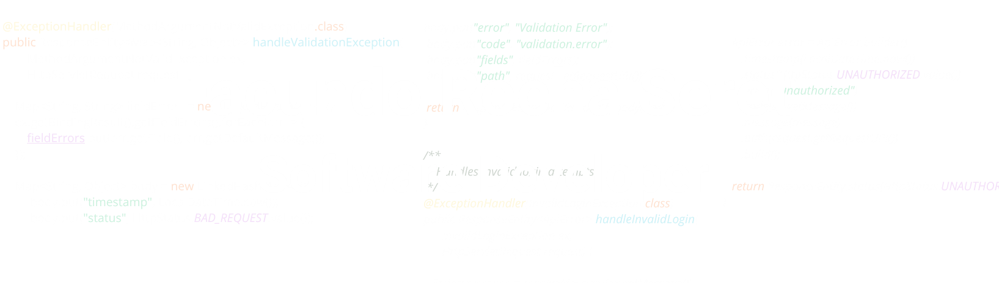

<picture>
  <source media="(prefers-color-scheme: dark)" srcset="./assets/dark.png">
  <source media="(prefers-color-scheme: light)" srcset="./assets/light.png">
  
</picture>

<div align="center">
  
<a href="https://portfolio-two-fawn-85.vercel.app/">
  
</a>

<a href="https://github.com/FacuRochaS">
  
</a>

<a href="https://www.linkedin.com/in/facundo-rocha-seret-49aba5293/">
  
</a>

<a href="https://codeforces.com/profile/FacuRocha">
  
</a>

<a href="https://www.skills.google/public_profiles/cf3d8aa2-b0ec-471e-9c1b-237aea4bc3a7">
  
</a>

<a href="mailto:facurochaseret@gmail.com">
  
</a>

</div>
<div align="center">


```txt
Computer Science student at FaMAF - National University of Córdoba.
Currently finishing a Programming Technician degree at UTN.
Data Science & AI Diploma.
Google SkillBoost badges in Cybersecurity, Generative AI and Cloud Data Analytics.

Focused on backend development, algorithms, Linux and software engineering.
```

```txt
22 years old | Córdoba, Argentina
Backend • Frontend • Algorithms • AI
```

</div>


<div align="center">

# Technologies

<table align="center" style="margin:auto;">

<tr>

<td valign="top" width="33%" align="center">

## Backend


<p>
  
</p>


• C#  ASP.NET Entity Framework 
• Java Spring Boot 
• REST APIs
• Microservices

• Testing JUnit Mockito 
• Design Patterns 
• Clean Architecture
• Layered Architecture


</td>

<td valign="top" width="33%" align="center">

## Frontend


<p>
  
</p>


• Angular 
• TypeScript
• JavaScript 
• HTML 
• CSS

• Responsive UI 
• SPA Development 
• Component-Based Architecture


</td>

<td valign="top" width="33%" align="center">

## Databases


<p>
  
</p>


• SQL PostgreSQL, MySql, SqlServer
• MongoDB 
• Redis 
• Database Design


</td>

</tr>

<tr>

<td valign="top" width="33%" align="center">

## DevOps & Workflow


<p>
  
</p>


• Docker 
• Linux
• Git 
• GitHub
• CI/CD Basics 

• Scrum 
• Agile Methodologies  
• Jira 
• Taiga  


</td>

<td valign="top" width="33%" align="center">

## Algorithms


<p>
  
</p>


• Competitive Programming
• Mathematics 
• Problem Solving


</td>

<td valign="top" width="33%" align="center">

## Other


<p>
  
</p>


• Python 
• Haskell 
• Data Science 
• Functional Programming 
• Games


</td>

</tr>

</table>

</div>


<div align="center">

# GitHub Activity


</div>

<br>

<div align="center">


<div align="center">

# Featured Projects

</div>


<table align="center" style="margin:auto;">

<tr>

<td width="33%" valign="top" align="center">

##  STUDER

```txt
Educational Social Media 
```

Reusable educational blocks with
versioning, collaboration and
community-driven content.

<p>
  
</p>

```txt
System Design • Backend
• Educational Technology
```

<a href="https://github.com/FacuRochaS/STUDER">
  
</a>

</td>

<td width="33%" valign="top" align="center">

## T.E.G

```txt
online web game
```

Backend-oriented web platform for
movie scheduling, administration
and function management.

<p>
  
</p>

```txt
ASP.NET • Entity Framework
REST APIs • SPA
```

<a href="https://github.com/FacuRochaS/Competitive-Programing">
  
</a>

</td>


<td width="33%" valign="top" align="center">

##  Competitive Programming

```txt
Algorithms & Problem Solving
```

Repository focused on data
structures, mathematics and
competitive programming.

<p>
  
</p>

```txt
STL • Graphs • DP
Math • Problem Solving
```

<a href="https://github.com/FacuRochaS/Competitive-Programing">
  
</a>

</td>

</tr>

</table>

---

<div align="center">

```txt
Thanks for visiting my profile.

Trying to improve continuously...
(or at least not get worse).

Feel free to follow or check out my projects.
```

</div>
